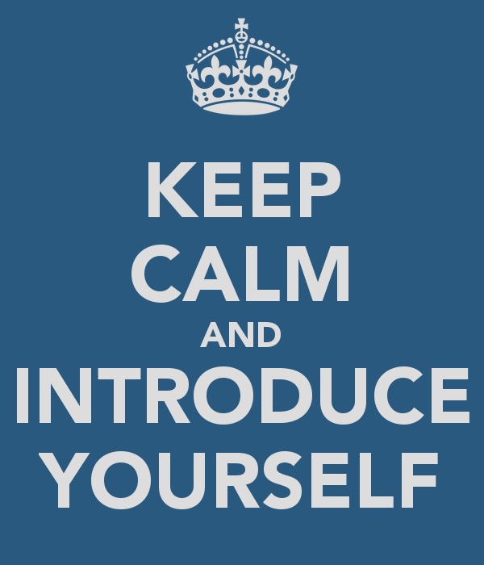

# Class Introduction

- This is the site for the July 2024 Class _AI Implications for Business Strategy_

# Logistics

- The class runs from 10am to 5pm from July 15 to July 16
- Lunch is from 1 to 2pm without fail. This gives you a predictable block of time to manage out of class issues like returning calls and scheduling meetings.
- There is a 15min break mid-morning-ish and another mid-afternoon-ish. The actual time will depend on where we are in the flow of the material.

## Introductions

### Rod Davison

I have been involved in the technology industry for over 50 years, starting in 1972
- Academia (theoretical mathematics, linguistics, cognitive science, psychology)
- Artificial Intelligence R&D and product development since 1982
- Software development, commercial products and large scale systems (e.g., compiler development and computerizing stock exchanges)
- Data Analytics – Social Research and professional Market Research
- Project Manager and Research Director
- Quality and Testing Professional and Manager
- Business Analysis and forensic investigation
- Consulting and training in advanced technology, management and

- I have worked with government agencies in Canada and the US, defense contractors and aerospace firms, major financial institutions (many years on Wall Street NYC) since 1982.
- I am currently continuing my research into artificial intelligence theory and applications.

### And now...

Please introduce yourself briefly using the following as a guide.
- Name you prefer to be called in class, if different from the one listed on the class list
- Your area of professional focus (developer, SRE, tester, business analyst, operations, planning, etc.)
- Any experience you have with artificial intelligence and/or machine learning
- Any specific objectives for the class or specific takeaways you are looking for
- Just to humanize things, tell us one non-technical thing about yourself, like a hobby or special interest.

## Class Materials

This is the [GitHub resources repository](https://github.com/ExgnoRepos/2418-AI_Business-Jul-15) for the class

Materials in the repository will be available until August 16, 2024

## VMS

- You will each be provided with a VM and your own copy of RQM.
- In the first lab, the instructor will walk you through the process of logging into the VM and starting the application
- The VMs will be available continuously until at least 6pm on July 12

## Class Protocols

The measure of how effective this class is how much you learn as opposed to the amount of material thrown at you during these four days.

In keeping with that, my classes are run under the following protocols.

- __Questions are ALWAYS appropriate.__ Ask questions when they occur to you and are fresh in your mind. Normally, I notice when someone raises their hand, but I don't seem to have notices, then do unmute yourself and get my attention.
- At various points during the class, I will run through the participant list and check to see how you are coming along with the material. This is my measure of how well we are doing as a class, so if you feel lost or confused, this is when you tell me. Almost always, if you are confused, it's because I didn't explain something well enough.
- If you know in advance that if you are going to be late or away for part of the class, let me know in advance, so I don't hold the class up waiting.
- __Have Fun!!!__
